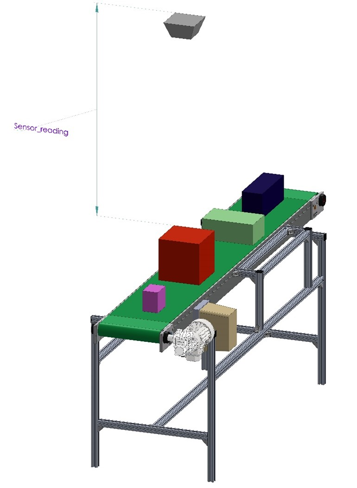

# ROS2 industrial basics

## ROS Publishers and Subscribers:

In this assignment, you will complete a code provided to you in assignment1.py  by adding code to replace the <write your code here> bits in the file, corresponding to each part of this assignment. 

Your goal is to publish to and subscribe to a topic. Now, what is new about doing this when you already saw me do this in the lectures? Well, in the lecture I used two ROS nodes, one for publisher and one for subscriber. But in this assignment, you will use only ONE ROS node for both publisher and subscriber. You will do this assignment in 3 parts, and only when you complete all 3 parts, the code will work correctly.

Let’s first set up the robotic problem we want to solve.

The recently purchased Ultrasound sensor we saw in the video has now been installed as shown in the picture below.

The main task of this assignment is to publish a new topic that contains the height of the detected boxes based on the setup shown in the figure.




Start the simulation of the range sensor
```bash
ros2 run range_sensor sensor_info_publisher_simulation
```

Examen excisting topic
```bash
ros2 topic list
```
Display messages on topic
```bash
ros2 topic echo /sensor_info
```
## Part1:

When there is no box, the sensor publishes the maximum range value which is the distance to the conveyor belt and it reports the distance to the top surface of the box when it does detect one. However, there is also an indication in the data sheet that, although the advertised maximum range is 2.0m, the usable range is only 1.9m and any value above that is sensor noise, which means, there can be false positives in the sensor data.

So, in this part, you will MODIFY assignment1.py to achieve the following goals:

1. Subscribe to the /sensor_info topic.

2. Compute the height of the box from the sensor reading.

3. Filter out the false positives from the sensor due to sensor noise.

Please upload a screenshot of the code you have implemented for this part.

You can test your node by starting the following node first in a different hrwros terminal:

Start assignment 1
```bash
ros2 run range_sensor assignment1
```
## Part2:

Now that you have the valid height information only, you will create a new message type called BoxHeightInformation.msg, which contains a place holder called “box_height” which is a floating point number. This way you can share detected box height information with other ROS nodes in your application. You can complete this part WITHOUT MODIFYING week1_assignment1.py as follows:

1. Create a new message type BoxHeightInformation.msg in the same folder where SensorInformation.msg file is located.

2. Add a place holder box_height of floating point number type in this message file.

3. Generate the new message type as instructed in the lecture

Upload a screenshot of the command:

## Part3:

Now, you are ready to publish a new ROS topic “/box_height_info” ONLY when a valid box is detected. You are not supposed to publish anything when the detected box height was invalidated due to sensor noise.

You can complete this part by finishing doing the next changes on the week1_assignment1.py script:

1. Create an object of the new BoxHeightInformation message type ONLY when you need it, that is only when the detected box height is valid.

2. Create a publisher for the new message type in the main python module.

3. Publish the box height information on the /box_height_info topic ONLY when the detected box has a valid height.

Once you have finished this, and the previous two parts of the assignment, you can run the system.

To run it follow this steps:

Step 1: Start up a terminal, source your setup files, and launch the rosmaster:

$ roscore

Note: ALWAYS SOURCE YOUR SETUP files whenever you start a new terminal. It is assumed you will do this all the time and this instruction will not be repeated in the future when you are asked to start a new terminal

Step 2: In a new terminal, start the sensor info publisher

$ rosrun hrwros_week1 sensor_info_publisher.py

Step 3: In a new terminal, Run the week1_assignment1.py script with

$ rosrun hrwros_week1 week1_assignment1.py

Step 4: In a new terminal, run the command 

$ rostopic list.

Step 5: If you see the topic /box_height_info listed, verify that it has a publisher with the command

$ rostopic info /box_height_info

Step 6: Finally, use the command 

$ rostopic echo /box_height_info

And wait until you see 5 messages of type BoxHeightInformation. Terminate this command with Ctrl+C and upload a screenshot of the output.

This completes Assignment 1.


Start assignment 2
```bash
ros2 run range_sensor assignment2
```

[Back](../README.md)

