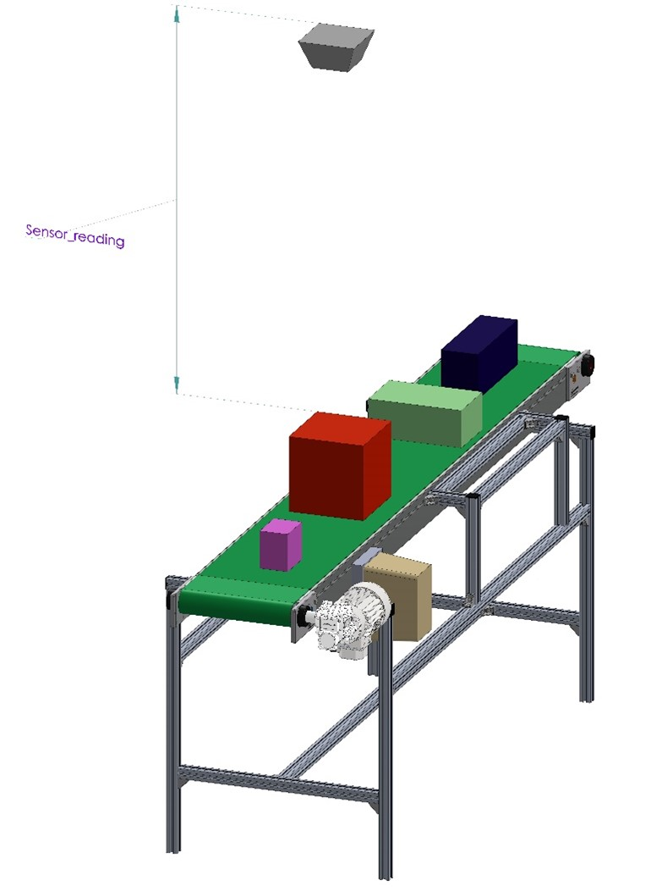

## Under construction

## ROS Topics: Publishers and Subscribers

In deze workshop leer je de basis van ROS2 topics. De theorie hiervan wordt gedoceerd, maar kun je ook vinden op deze [website van ROS](https://docs.ros.org/en/humble/Tutorials/Beginner-CLI-Tools/Understanding-ROS2-Topics/Understanding-ROS2-Topics.html)

We gaan in deze en volgende workshops aan de slag met een hoogte meting van dozen op een conveyor(transportband), zie afbeelding hieronder.




In de workshop wordt de range-sensor gesimuleerd door een node met een topic welke de afstand van een voorwerp tot de range-sensor weergeeft.
p.s. Je kunt ook van een fysieke range-sensor gebruik maken, dit staat beschreven in [ESP32 ultatrasonic-sensor](../ESP32/ultrasonic_sensor/README.md)

Start de node die de range-sensor simuleert.

```bash
ros2 run range_sensor sensor_info_publisher_simulation 
```
n.b. In de terminal zal slechts 1 regel output worden gegenereerd

Controleer of de range-sensor node ook daadwerkelijk gestart is(doe dit in een nieuwe terminal)
```bash
ros2 node list
```
Bekijk welke topics(onderwerpen) door de node gepubliceerd worden
```bash
ros2 topic list
```
Volg de messages(berichten) die op het topic worden gepubliceerd

```bash
ros2 topic echo /sensor_info
```
Je kunt deze monitor stoppen door ctrl+c

Informatie opvragen over het gebruik van de topic

```bash
ros2 topic info /sensor_info
```
Je vindt hierin de volgende informatie
* Bericht type ook wel interface of message-type genoemd
* Aantal nodes dat publiceren op dit topic
* Aantal nodes dat lezen van dit topic

Informatie opvragen over het bericht type, ook wel interface genoemd
```bash
ros2 interface show range_sensors_interfaces/msg/SensorInformation
```

## Opdracht 1
In deze opdracht ga je een subscriber maken in een Python programma op het topic **/sensor_info**

Je gaat daartoe het Python programma **assignment1.py** bewerken op bepaalde aangeven plaatsen.


Je kunt de broncode van het programma openen met de editor uit je development omgeving(bijvoorbeeld Visual Code), door naar de juiste map/directory te navigeren.
Het bestand bevindt zich op de volgende locatie:
**~/ros2_industrial_ws/src/ROS2_industrial/1_basics/range_sensor/range_sensor/**


Als alternatief kunt het bestand ook op de volgende wijze openen:
```bash
gedit ~/ros2_industrial_ws/src/ROS2_industrial/1_basics/range_sensor/range_sensor/assignment1.py
```


Opmerking: als gedit nog niet is geinstalleerd dan kun je dat als volgt doen:
```bash
sudo apt install gedit
```
## Opdracht 1.1 creeër een Python subscriber
Maak op onder de regel een subscriber aan met de vogende gegevens:
* Topic: /sensor_info
* Message-type: sensor_info
* Callback: sensor_info_callback

Noem de subscriber 'sensor_info_subscription', zorg ervoor dat dit in de context van de klasse gebeurt, door de *self* operator.
Voer de code in onder onderstaande regel in het assignment1.py bestand

*<Assignment 1.1, creeër hier de subscriber op het topic /sensor_info>*

Test de werking van het programma
```
ros2 run range_sensor assignment1 
```

## Opdracht 1.2 Bereken de hoogte van de doos en druk deze af

## Opdracht 1.3 Creeër een nieuw message type

## Opdracht 1.4 Creeër een Python publisher

## Opdracht 1.5 Publiceer de hoogte van de doos

## Opdrcaht 1.6 Gebruik rgt-graph


## Deze opdracht moet nog uitgeschreven worden in het nederlands

In this assignment, you will complete a code provided to you in assignment1.py  by adding code to replace the <write your code here> bits in the file, corresponding to each part of this assignment. 

Your goal is to publish to and subscribe to a topic. Now, what is new about doing this when you already saw me do this in the lectures? Well, in the lecture I used two ROS nodes, one for publisher and one for subscriber. But in this assignment, you will use only ONE ROS node for both publisher and subscriber. You will do this assignment in 3 parts, and only when you complete all 3 parts, the code will work correctly.

Let’s first set up the robotic problem we want to solve.

The recently purchased Ultrasound sensor we saw in the video has now been installed as shown in the picture below.

The main task of this assignment is to publish a new topic that contains the height of the detected boxes based on the setup shown in the figure.


[Officieel Understanding topics](https://docs.ros.org/en/humble/Tutorials/Beginner-CLI-Tools/Understanding-ROS2-Topics/Understanding-ROS2-Topics.html)

Start the simulation of the range sensor
```bash
ros2 run range_sensor sensor_info_publisher_simulation
```
Liever met een echte sensor werken zie:
[MicroROS ESP32 implementatie van range-sensor](./ESP32/README.md)

Examen excisting topic
```bash
ros2 topic list
```
Display messages on topic
```bash
ros2 topic echo /sensor_info
```
## Part1:

When there is no box, the sensor publishes the maximum range value which is the distance to the conveyor belt and it reports the distance to the top surface of the box when it does detect one. However, there is also an indication in the data sheet that, although the advertised maximum range is 2.0m, the usable range is only 1.9m and any value above that is sensor noise, which means, there can be false positives in the sensor data.

So, in this part, you will MODIFY assignment1.py to achieve the following goals:

1. Subscribe to the /sensor_info topic.

2. Compute the height of the box from the sensor reading.

3. Filter out the false positives from the sensor due to sensor noise.

Please upload a screenshot of the code you have implemented for this part.

You can test your node by starting the following node first in a different hrwros terminal:

Start assignment 1
```bash
ros2 run range_sensor assignment1
```
## Part2:

Now that you have the valid height information only, you will create a new message type called BoxHeightInformation.msg, which contains a place holder called “box_height” which is a floating point number. This way you can share detected box height information with other ROS nodes in your application. You can complete this part WITHOUT MODIFYING week1_assignment1.py as follows:

1. Create a new message type BoxHeightInformation.msg in the same folder where SensorInformation.msg file is located.

2. Add a place holder box_height of floating point number type in this message file.

3. Generate the new message type as instructed in the lecture


## Part3:

Now, you are ready to publish a new ROS topic “/box_height_info” ONLY when a valid box is detected. You are not supposed to publish anything when the detected box height was invalidated due to sensor noise.

You can complete this part by finishing doing the next changes on the week1_assignment1.py script:

1. Create an object of the new BoxHeightInformation message type ONLY when you need it, that is only when the detected box height is valid.

2. Create a publisher for the new message type in the main python module.

3. Publish the box height information on the /box_height_info topic ONLY when the detected box has a valid height.

Once you have finished this, and the previous two parts of the assignment, you can run the system.

To run it follow this steps:

instruction will not be repeated in the future when you are asked to start a new terminal

Step 1: In a new terminal, start the sensor info publisher

```bash
$ ros2 run range_sensor sensor_info_publisher_simulation
```

Step 2: In a new terminal, Run the assignment1.py script with

```bash
$ ros2 run range_sensor assignment1
````

Step 3: In a new terminal, run the command 

```bash
$ ros2 topic list.
```

Step 5: If you see the topic /box_height_info listed, verify that it has a publisher with the command

```bash
$ ros2 topic info /box_height_info
````

Step 6: Finally, use the command 

```bash
$ ros2 topic echo /box_height_info
```

And wait until you see 5 messages of type BoxHeightInformation. Terminate this command with Ctrl+C and upload a screenshot of the output.

This completes Assignment 1.


Start assignment 2
```bash
ros2 run range_sensor assignment2
```

[Back](../README.md)