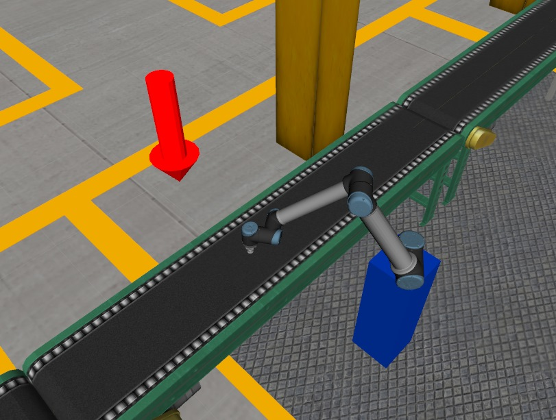
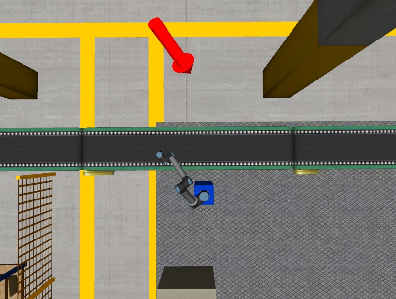
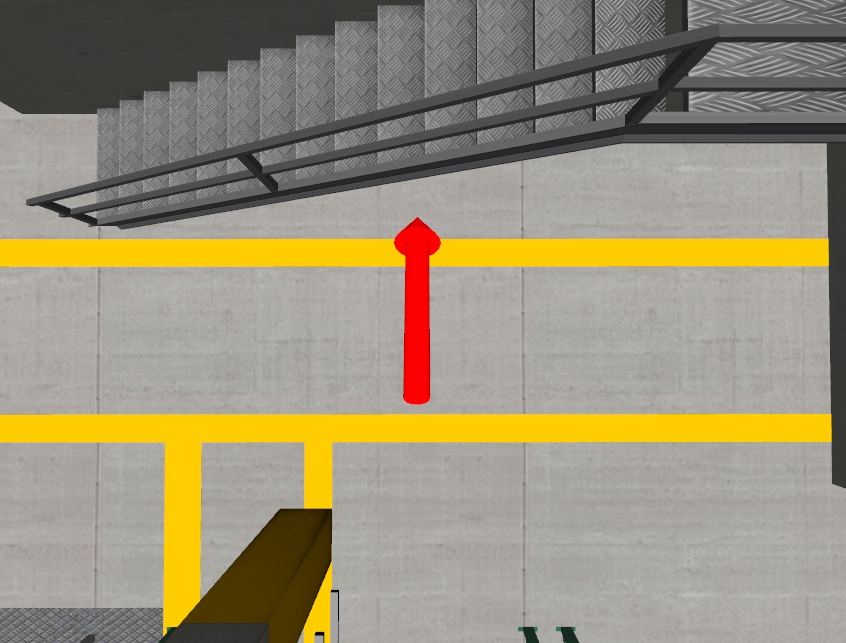
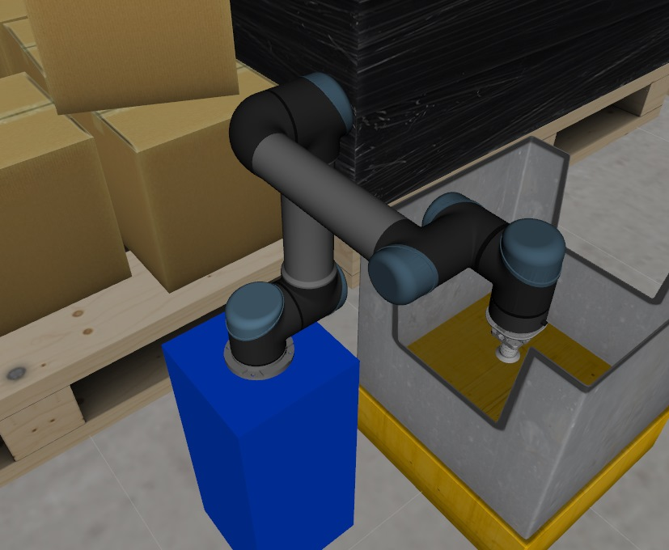
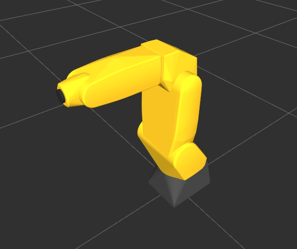

# ROS urdf

Under contruction\
In deze workshop leer je een aantal technieken om zelf realistische simulatie omgeving te maken.

## Opdracht 1
Plaats een bin(bak) op de hieronder aangegeven plaats.
<div style="display: flex; justify-content: center; align-items: center; gap: 10px;">
    
    
</div>
Bewerk daartoe het "assignment1.urdf.xacro" bestand in de package urdf_basics van 2_urdf directory.
Voeg je urdf-xml code toe achter de regel:

&lt;!-- Add your solution to assignment 1 here --&gt;


Start assignment 1
```bash
ros2 launch urdf_basics visualize_assignment1.launch.py
```

## Opdracht 2
<div style="display: flex; justify-content: center; align-items: center; gap: 10px;">
    
    
</div>

.. raw:: html
   <div style="display: flex; justify-content: center; align-items: center; gap: 10px;">
       
       
   </div>


Start assignment 2
```bash
ros2 launch urdf_basics visualize_assignment2.launch.py
```
## Opdracht 3
<div style="display: flex; justify-content: center; align-items: center; gap: 10px;">
    
    
</div>
Start assignment 3
```bash
ros2 launch urdf_basics visualize_assignment3.launch.py
```

