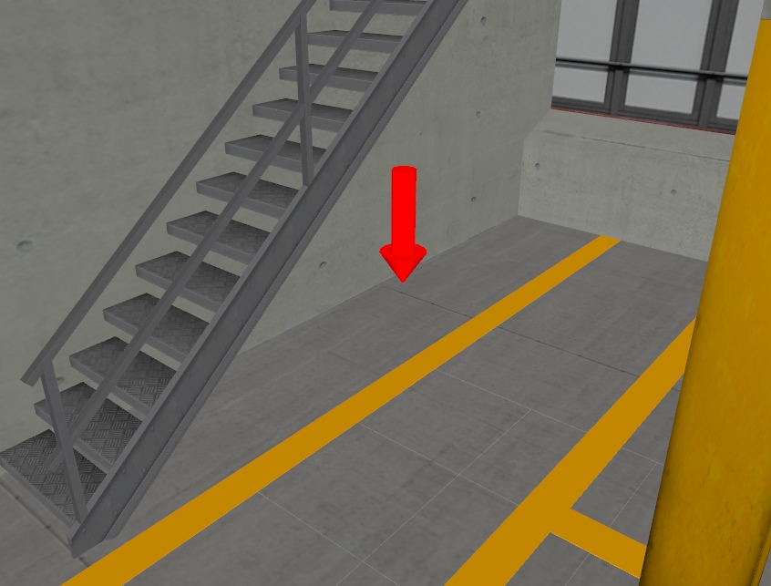

# ROS urdf
## Commando's
Under contruction


## Opdracht 1
<div style="display: flex; justify-content: center; align-items: center; gap: 10px;">
    
    
</div>

Start assignment 1
```bash
ros2 launch urdf_basics visualize_assignment1.launch.py
```

## Opdracht 2
<div style="display: flex; justify-content: center; align-items: center; gap: 10px;">
    
    
</div>


Start assignment 2
```bash
ros2 launch urdf_basics visualize_assignment2.launch.py
```
## Opdracht 3
<div style="display: flex; justify-content: center; align-items: center; gap: 10px;">
    
    
</div>
Start assignment 3
```bash
ros2 launch urdf_basics visualize_assignment3.launch.py
```

