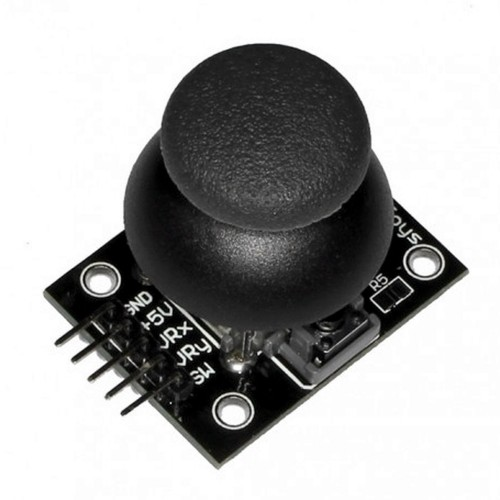

# MicroROS ESP32 implementatie van een joystick
In dit voorbeeld wordt een joystick sensor gekoppeld aan den ESP32 device. Nadat deze is geprogrammeerd zal dit device een topic **/cmd_vel** publiceren[Twist message-type](https://docs.ros.org/en/humble/p/geometry_msgs/msg/Twist.html). Met de joystick sensor kun je vervolgens een rijdende robot, zoals b.v. een [Turtlebot](https://www.turtlebot.com/), besturen.

## Algemene microROS informatie
Informatie over het installeren van microROS kun je [hier](../../references/microros/microros.md) vinden.

## Openen van een microROS project
Open met Visual Code project van de joystick in de volgende map (alleen map selecteren):
```text
~/ros2_industrial_ws/src/ROS2_industrial/3_navigation/ESP32/joystick
```

## SRF-04 aansluiten


|    ESP32 Pin     | Joystick Pin |
|:----------------:|:----------:|
|        3V3        |    +5V     |
|       GND        |    GND     |
| ANGULAR_PIN(*) | VRx       |
| LINEAR_PIN(*) | VRy       |
 
 (*) Deze pin-aansluitingen (van je gekozen ESP32 device) kun je vinden in het *platformio.ini* bestand:
```bash
gedit ~/ros2_industrial_ws/src/ROS2_industrial/3_navigation/ESP32/joystick/platformio.ini
``` 

## Testen
Nadat het device is geprogrammeerd kun je de werking controlleren met;
```bash
ros2 topic echo /cmd_vel
```

{octicon}`alert;2em;sd-text-info` Als de joystick niet reageert zoals je verwacht, kun je de **ORIENTATION** build-flag aanpassen.

{octicon}`alert;2em;sd-text-info` Je dient wel eertst de microROS-agent te starten. 