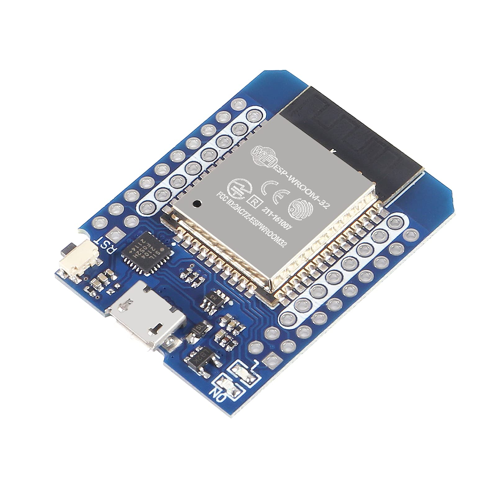
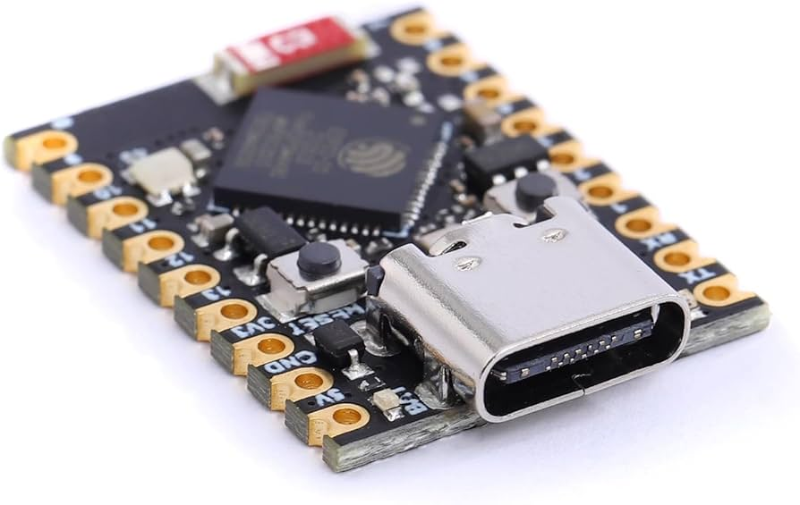
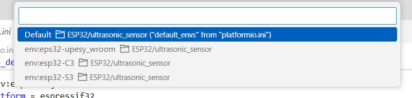
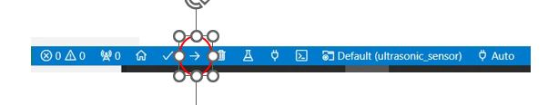

# microROS
## Algemene informatie

Met microROS is het mogelijk om een communicatie kanaal tussen een embedded systeem en ROS2 op te bouwen. Dit communicatie kanaal maakt het mogelijk om dan op de embedded systeem de volgende ROS2 methodes te gebruiken:
* Topics
* Services
* Actions

Gedetaileerde informatie over microROS zie website: [microROS](https://micro.ros.org/)

## Installatie van microROS-agent
microROS maakt gebruik van een agent welke als brug(bridge) tussen het embedded systeem en ROS2 fungeert.

Je kunt kunt de microROS-agent als volgt installeren:


:::::{card} 
::::{tab-set}

:::{tab-item} Installatie script

```bash
cd ~/ros2_industrial_ws/src/ROS2_industrial/microros/scripts
./install_microros_agent.sh
source ~/microros_ws/install/setup.bash
```
:::

:::{tab-item} Handmatig installeren

Zie: [first_application_linux](https://micro.ros.org/docs/tutorials/core/first_application_linux/)

:::

::::

:::::

## Ontwikkelomgeving
{octicon}`alert;2em;sd-text-info` Om een microROS applicatie te ontwikkelen dient in Visual Studie Code de **PlatformIO** plugin geinstalleerd.
Voor **WSL** is dat beschreven in de [Windows Subsystem for Lunix](https://avansmechatronica.github.io/WindowsSubsystemForLinuxHandleiding/documentation/WSL_Handleiding.html#platform-io)

## ESP32 devices
In deze workshop wordt gewerkt met de volgende ESP32 devices:

:::::{card} 
::::{tab-set}

:::{tab-item} ESP32-WROOM


Environmet: eps32-upesy_wroom
Environment: **eps32-upesy_wroom** 
```text
platform = espressif32
board = esp32-s3-devkitc-1
```
[Info](https://www.espboards.dev/esp32/upesy-wrover/)


:::

:::{tab-item} ESP32-WROOM-Mini

Environment: **eps32-upesy_wroom** 
```text
platform = espressif32
board = esp32-s3-devkitc-1
```
[Info](https://www.espboards.dev/esp32/upesy-wrover/)

{octicon}`alert;2em;sd-text-info`Deze ESP32-WROOM-Mini heeft dezelfde specificatie als de ESP32-WROOM, echter de pinout is afwijkend:


:::

:::{tab-item} ESP32C3-Mini


Environment: **esp32-C3** 
```text
platform = espressif32
board = lolin_c3_mini
```
[Info](https://www.espboards.dev/esp32/esp32-c3-super-mini/)

:::

:::{tab-item} ESP32S3-Mini

Environment: **esp32-S3** 
```text
platform = espressif32
board = esp32-s3-devkitc-1
```
[Info](https://www.espboards.dev/esp32/esp32-s3-zero/)

:::

::::

:::::

*In het platformio.ini bestand van het project kun je details m.b.t. compileropties voor ieder environment inzien.*

## Uploaden programma naar ESP32 devices
### Environment selecteren
Alvorens je een microROS programma kan compileren dien je de juiste environment te selecteren die bij het het gekozen ESP32 board past.
Activeer de environment slectector:


Kies daarna de juiste environmet:



### Software Compileren
Je kunt het programma voor het device compileren met onderstaande functie:


### Uploaden naar ESP32 device
Nadat je het device hebt aangesloten via USB kun je de software naar het device uploaden:



Nadat de software succesvol is geüpload zal het programma automatisch in het device starten.

Tip: *Tijdens het uploaden zal getoond worden welke USB-device hiervoor gebruikt wordt. Maak hiervan een aantekening deze heb je nodig bij het starten van de microROS-agent.*

{octicon}`alert;2em;sd-text-info` Bij gebruik van WSL moet je het embedded systeem wel eerst met WSL verbinden, zie [Koppelen USB-devices aan WSL-Distributie](https://avansmechatronica.github.io/WindowsSubsystemForLinuxHandleiding/documentation/WSL_Handleiding.html#koppelen-usb-devices-aan-wsl-distributie)

{octicon}`alert;2em;sd-text-info`Zorg er voor dat bij het uploaden de bijbehorende microROS-agent is afgesloten.

{octicon}`alert;2em;sd-text-info`Start in geen geval de *Serial Monitor*. Deze zal de communicatie over USB naar de microROS-agent blokkeren.


## Voorbeelden
Er zijn in het kader van deze modules al twee microROS implementaties gerealiseerd voor de volgende workshops:

* ROS2 Basics: [range-sensor](../../1_basics/ESP32/ultrasonic_sensor.md)

* Manipulation: [joystick](../../3_navigation/ESP32/joystick.md)

De microROS-agent kan worden gestart met het volgende commando:

```
ros2 run micro_ros_agent micro_ros_agent serial --dev <usb-device>
```

Afhankelijk op welke USB poort je het embedded systeem hebt aangesloten dien je usb-device in te vullen.
 Bijvoorbeeld:
 * /dev/ttyUSB0
 * /dev/ttyACM0

{octicon}`alert;2em;sd-text-info` Bij gebruik van WSL moet je het embedded systeem wel eerst met WSL verbinden, zie [Koppelen USB-devices aan WSL-Distributie](https://avansmechatronica.github.io/WindowsSubsystemForLinuxHandleiding/documentation/WSL_Handleiding.html#koppelen-usb-devices-aan-wsl-distributie)


 {octicon}`bell;2em;sd-text-info` Het device wordt getoond bij het uploaden/programmeren van het embedded systeem in Visual Code met de Platform IO plugin

